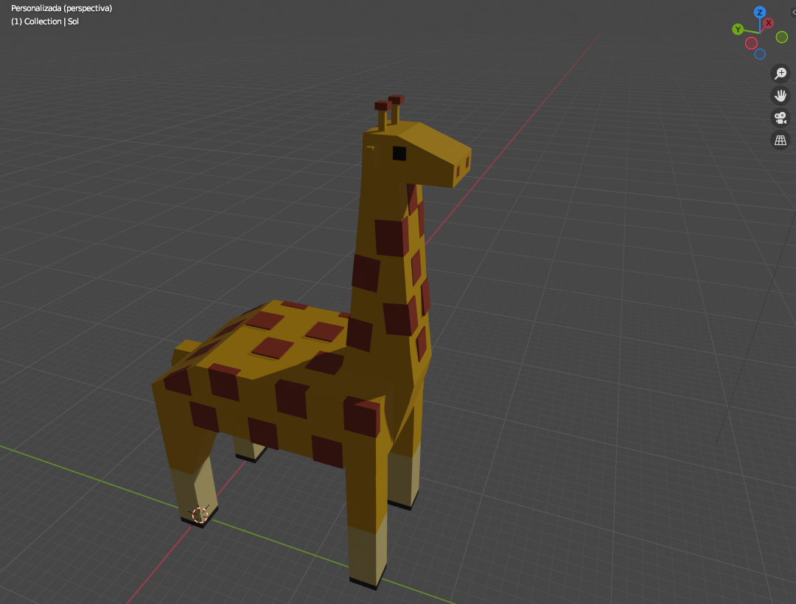

# Practica 03 - Creación de un personaje
Para esta actividad modele una Jirafa Lowpoly en Blender
## **Capturas de la jirafa**
La vista de lado:

La vista desde el otro lado:

La vista de frente:

La vista de espaldas:

