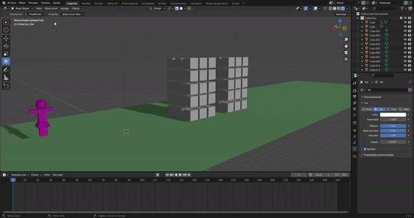
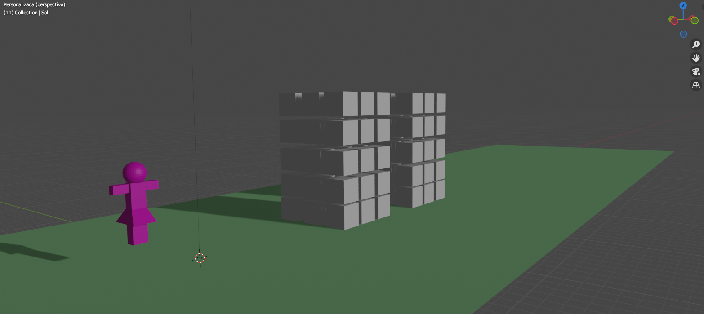
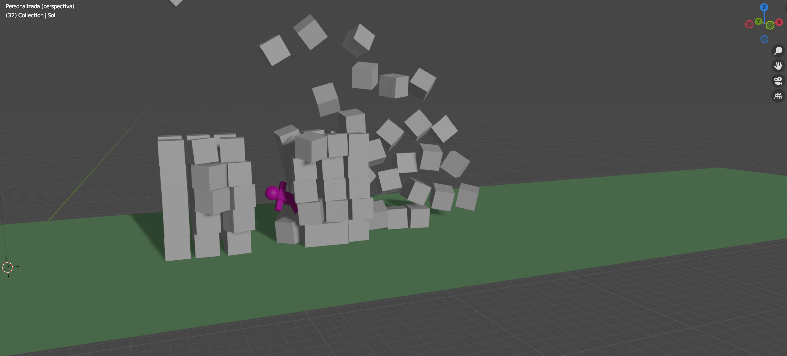
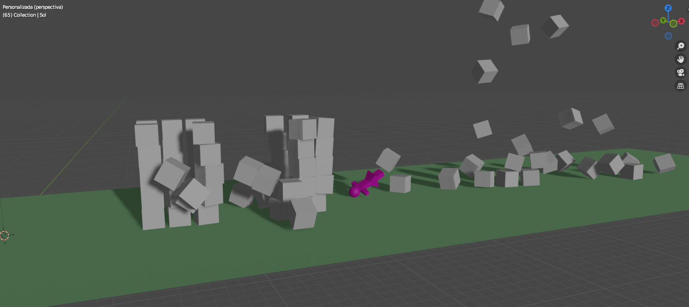

# Practica 04 - Simulación de colisión
## De Iván Mandujano González Moreno
En esta actividad se simuló el choque de un personaje con dos torres de cubos.
## **Simulación de la colisión**
Gif de colisión:

Escenario de la Simulación:

Antes de la colisión:

Durante la colisión:

Fin de la Simulación:
