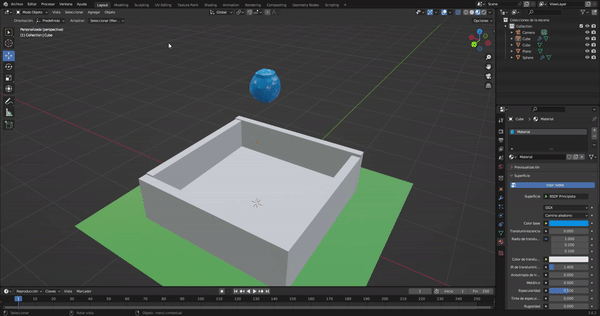

# Practica 05 - Simulación de liquido
## De Iván Mandujano González Moreno
En esta actividad se simuló el liquido dentro de un recipiente
## **Simulación del liquido**
Gif de simulación:

Escenario de la Simulación:

Durante la simulación:

Fin de la Simulación:
