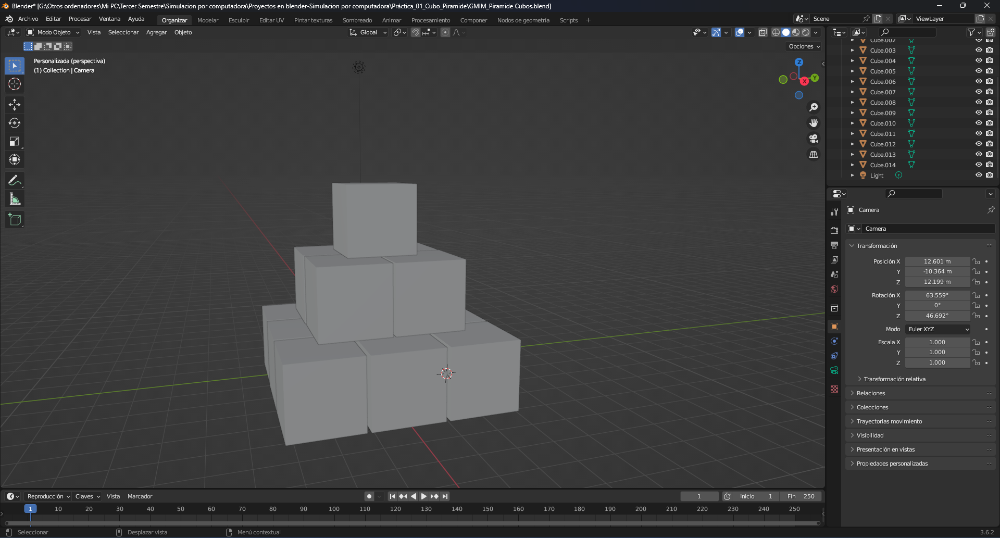
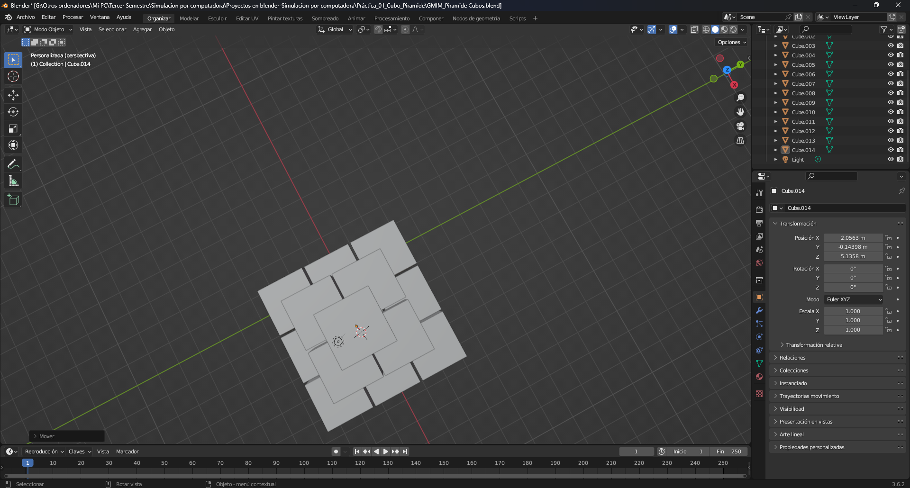
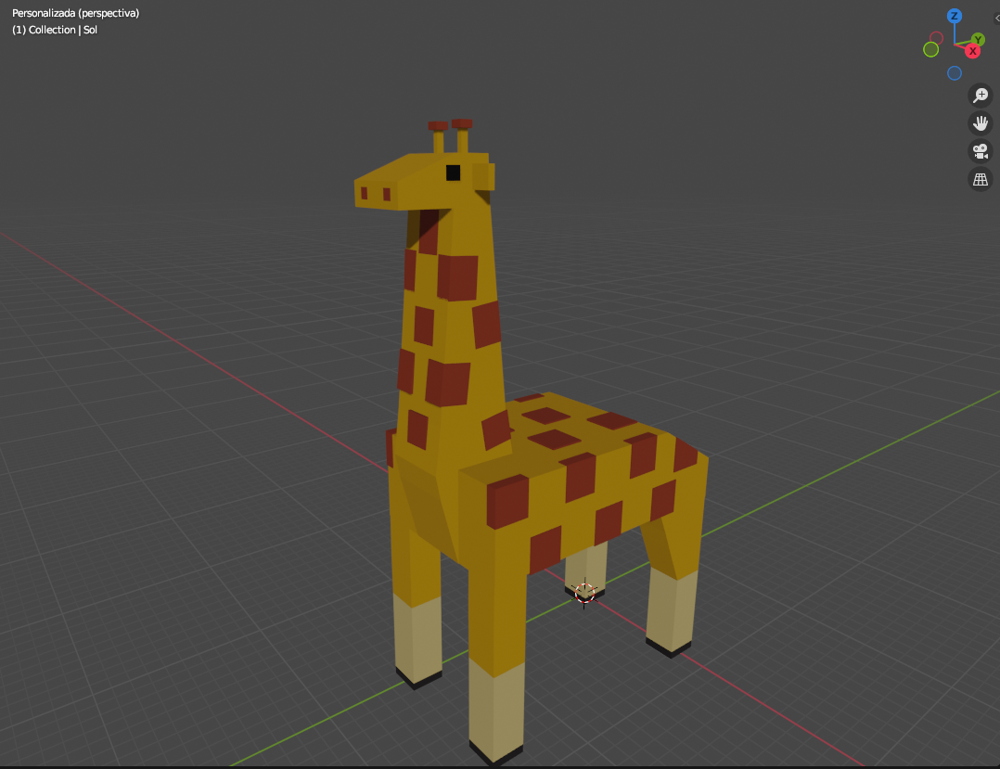
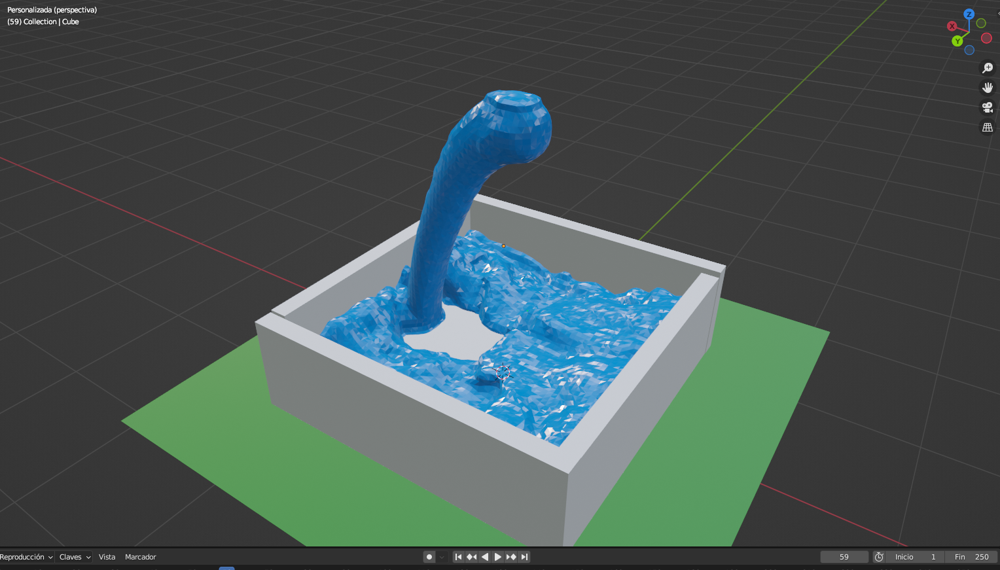

# Trabajos de Simulación por Computadora
## De Iván Mandujano González Moreno
## **Práctica 1: Piramide de cubos**
La piramide vista de lado:

Piramide vista desde arriba:

## **Práctica 2: Diorama**
Vista general al diorama:

Diorama desde cerca:

## **Práctica 3: Personaje**
Jirafa hecha en blender
Jirafa de lado:

Jirafa de frente:

Jirafa de espaldas:

## **Práctica 4: Simulación de colisión**
Colisión simulada en blender 
Gif de colisión:

Escenario de la Simulación:

Durante la colisión:

Fin de la Simulación:

## **Práctica 5: Simulación de liquido**
Gif de simulación:

Escenario de la Simulación:

Durante la simulación:

Fin de la Simulación:
